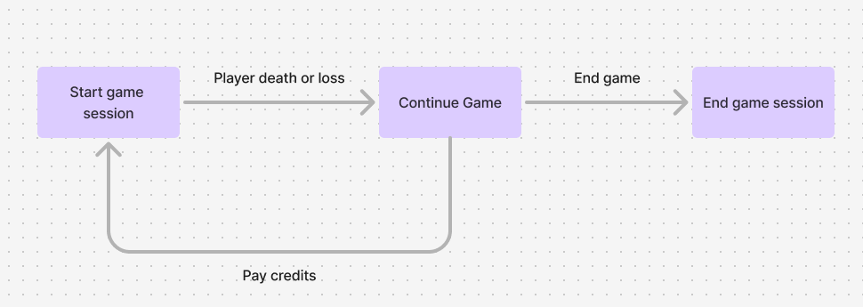

# TA BlockChain Game Unity SDK

> **Note** for support contact, dhruv304c2@gmail.com

### Content
1. [Introduction](#introduction)
2. [Installation](#installation)
3. [How to use](#how-to-use)
    1. [Config setup](#config-setup)
    2. [Using Services](#using-services)
    3. [Initial DataFetch](#initial-data-fetch)
    4. [Launching SDK Menus](#launching-sdk-menus)
    5. [Game Flow](#game-flow)
    6. [User Balance](#user-balance)
    7. [User Inventory](#user-inventory)
4. [UI design customisation](#ui-design-customisation)

## Introduction
The TA Blockchain SDK was created to provide a simple and easy way to integrate blockchain functionality into Unity games. The SDK provides a simple interface to interact with the blockchain and provides a simple way to authenticate users using web3Auth. The SDK is designed to be easy to use and provides a simple way to interact with the blockchain without having to worry about the underlying blockchain technology or Back-end architecture.

### Features
- **Web3Auth** - The SDK provides a simple way to authenticate users using web3Auth. The SDK handles all the complexity of web3Auth and provides a simple interface to authenticate users.
- **Leader Boards** - The SDK provides prefabs for leader board UI that can be easily integrated into your game. The SDK handles all the complexity of leader boards and provides a simple interface to interact with the leader boards.
- **User Profile** - The SDK provides prefabs for user profile UI and APIs to fetch profile data that can be easily integrated into your game. The SDK handles all the complexity of user profiles and provides a simple interface to interact with user profiles.
- **Booster Shop and Inventory** - The SDK provides APIs to fetch booster shop data and inventory data that can be easily integrated into your game. The SDK handles all the complexity of booster shop and inventory and provides a simple interface to interact with booster shop and inventory.
- **In App Purchases** - The SDK provides APIs to make in game purchases that can be easily integrated into your game. The SDK handles all the complexity of in game purchases and provides a simple interface to make in game purchases.
- **Push Notifications (Firebase)** - SDK handles device token registration and push notification using **Firebase** handling for your game. Notifications can be configure from backend server.

## Installation
You can install the package using git URL option in Unity package manager windowSDK package, using the following git URL
```
https://github.com/dhruvPant304/ta-blockchain-game-unity-sdk.git?path=Assets/src
```
please note that the SDK package does not include Android plugins that are required for web3Auth as it is observed that these plugins may conflict with existing plugins and cause build errors.
we suggest manually downloading Android plugins and only including the plugins that are not already present in your project.

## How to use

### **Getting started using the available samples**
We suggest downloading **PlayDoge-Tchi** sample included with the Unity package, from Unity package manager and making a copy of it in your project so you can start making changes to provided prefabs and not have them effected by subsequent package update. Then add the **Landing Page, Login and SignIn** scenes available in PlayDoge-Tchi sample as first,second and third scene in build settings respectively.

These scenes will prompt the user with the login/signup flows (auto login if they have a saved login session) and then load the **scene after SingIn scene in build settings** (build index 3), this scene will act as entry point to your game

### **Config setup**

In order to provide configuration options to the SDK you must create a few scriptable objects, ``APIConfig`` option and ``Web3AuthConfig`` are essential for all games. ``PurchasePackageData`` scriptable object is required for games that use IAP for credit/in-game-currency purchase.

create the required scriptable objects in the **Assets > Resources** folder and set the required values in the scriptable objects.

for web3auth redirection to work, you also need to create a file named **webauth** in the resources folder in this file add the redirect url you want to set.

``` title="webauth"
intent://com.fightout.fighting/auth
```

### **Using Services**

SDK gives you access to multiple services which methods to access and update data on the game server with much of the complexity abstracted away, below is an example illustrating how to access one of this service called the ```UserProfileService```

```csharp
var userProfileService = ServiceLocator.Instance.GetService<UserProfileService>()
```

### **Initial Data Fetch**

After login you would have to fetch some user data being balance data and inventory data to ensure this data is available.

```csharp
_userBalance = ServiceLocator.Instance.GetService<UserBalanceService>();
_userInventory = ServiceLocator.Instance.GetService<UserInventoryService>();

await _userBalance.UpdateUserBalance();
await _userInventory.FetchInventory();
```

### **Launching SDK Menus**

Once you have the scene set-up done, you might need a way for a user to launch the menus available, below is an example of how to create a profile menu button

```csharp
using TA.Menus;
using TA.Services;
using UnityEngine;
using UnityEngine.UI;

[RequireComponent(typeof(Button))]
public class OpenProfileMenuButton : MonoBehaviour{
    TAMenuService _taMenuService;

    void Start(){
        _taMenuService = ServiceLocator.Instance.GetService<TAMenuService>();
        GetComponent<Button>().onClick.AddListener(OpenProfile);
    }

    void OpenProfile(){
        _taMenuService.OpenProfilePage();
    }
}
```
 as can be seen in the example above, the button script uses ```TAMenuService``` and ```OpenProfilePage()``` function, below are all available Menu options:
 - ```OpenProfilePage()```
 - ```OpenSettingsPage()```
 - ```OpenLeaderBoardPage()```
 - ```OpenBuyCreditsMenu()```

### **Game Flow**

Typical game flow of a P2E game is:



you can use ```GameService``` and contained methods to trigger game flow events.

- ```StartGameSession()``` : Generates game token, performs required credit transactions and makes subsequent Game event APIs methods available (UpdateScore, ContinueGame, EndGameSession)

- ```UpdateScore(int score)``` : Updates score on server for the active game session, updated score is visible on leader boards.

- ```ContinueGame()``` : Restarts game session and perform required credit transactions

> **Note:** We suggest using existing ```TAMenuService``` game over menu, that provides users options to either continue or end game sessions, along with data like current score and leader board positions etc.

- ```EndGameSession()``` : Clears active game session

Game session also have some public events that can be subscribed to, like: 

- ```OnStartSessionSuccess```
- ```OnStartSessionFailed```
- ```OnUpdateScoreFailed```
- ```OnUpdateScoreSuccess```
- ```OnContinueGameSuccess```
- ```OnContinueGameFailed```
- ```OnEndSessionSuccess```
- ```OnEndSesssionFailed```

these, events can be used to handle game flow and manage server errors from underlying Backend APIs.

### **User Balance**

Often you would want to display or access user balance i.e amount of credits, xp (or any other currency defined on the back end) somewhere in the game.
Use ```GetBalanceIntCached(string type)``` method in ```UserBalanceService```

the type parameter in the ```GetBalanceIntCahced(string type)``` refers to the currency field name on the Backend server.

```csharp
int credits = GetBalanceIntCached("credits");
```
some game servers have APIs to allow developers to add certain currency types like game coins in PlayDoge-Tchi, use game ```AddGameCoin()``` function in ```GameService```

### **User Inventory**

To get the boosters and other purchasable items in user inventory use ```UserInventoryService```

```csharp
var inventoryService = ServiceLocator.Instance.GetService<UserInventoryService>();
InventoryCollection inventory = inventoryService.GetInventory();
var concreteItemTypes = inventory.As<MyItemType>();
```

class ```MyItemType``` is the concrete implementation of the Inventory Item JSON structure defined on back end, this allows flexibility in the data an inventory item can store when working on different games 

## UI Design Customisation

To customize UI Designs for SDK menus and UI elements you can use the prefabs available in the sample and change them according to the new designs

> **For Designers:** while creating designs for new games following the p2e game format please keep in mind to stick to existing Menus in terms of UI flow, although the layout of UI elements in individual menus is flexible, for example: it is possible to easily move edit profile button's position inside the profile menu screen but it would not be possible to move this button to settings menu screen